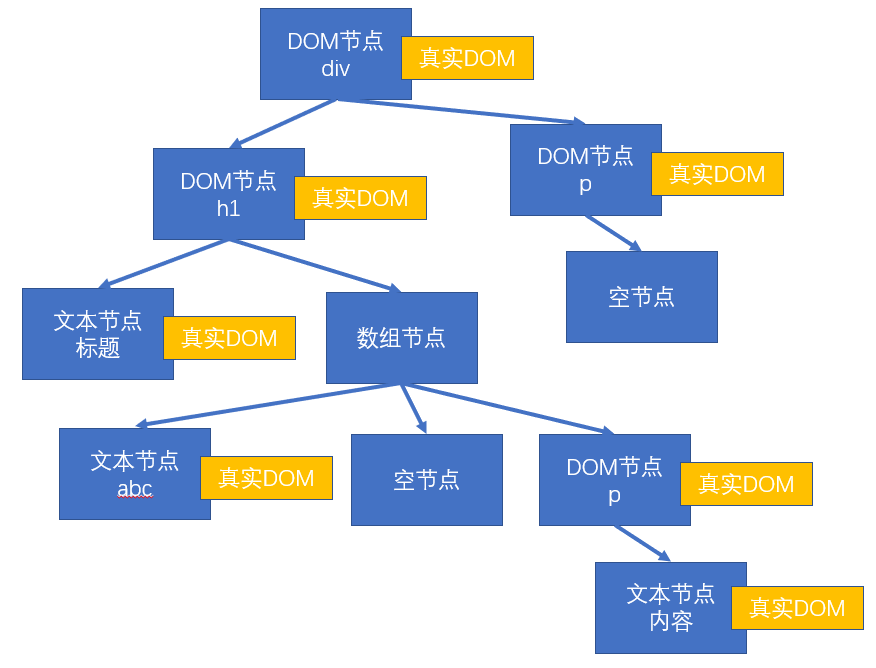
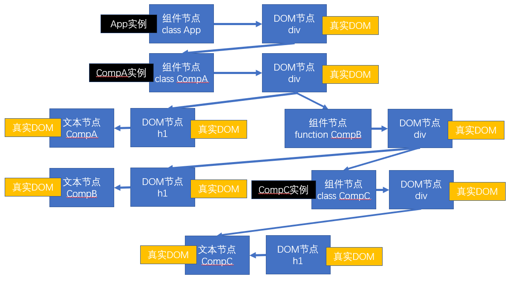
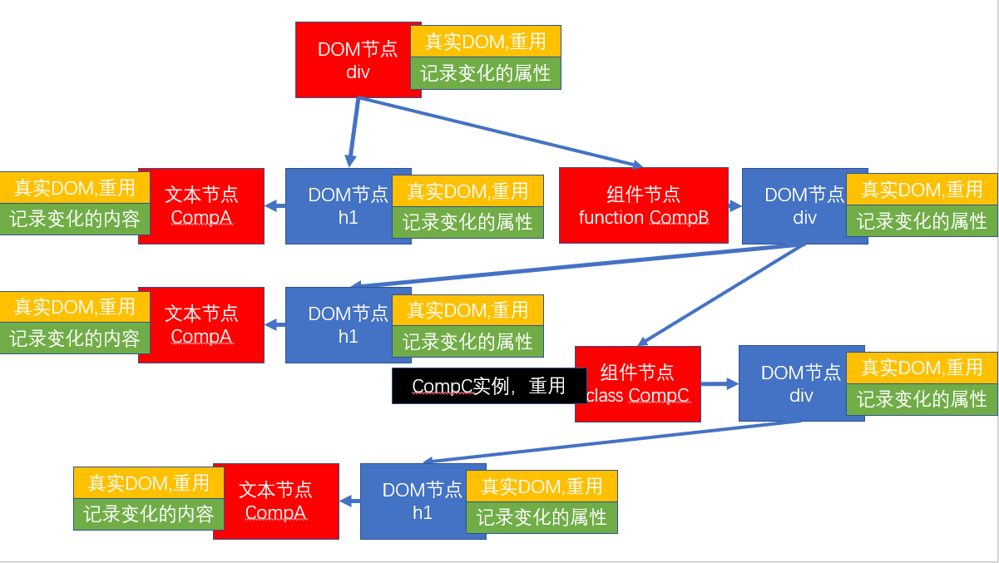

# 渲染原理

渲染：生成用于显示的对象，以及将这些对象形成真实的DOM对象

- React元素：React Element, 通过React.createElement创建（语法糖：JSX）
    - 例如：
    - ```<div><h1>标题</h1></div>```
    - ```<App />```
- React节点：专门用于渲染到UI界面的对象，React通过React元素，创建React节点，ReactDOM一定是通过React节点进行渲染的
    - 节点类型：
        - React DOM节点（ReactDOMComponent）：创建该节点的React元素类型是一个字符串
        - React 组件节点：创建该节点的React元素类型是一个函数或一个类
        - React TextNode节点：由字符串创建
        - React 空节点：由null、undefined、false
        - React 数组节点：该节点由一个数组创建
- 真实DOM：通过document.createElement创建


## 首次渲染（新节点渲染）

1. 通过参数的值创建节点
2. 根据不同的节点，做不同的事情
    1. 文本节点：通过document.createTextNode创建真实的文本节点
    2. 空节点：什么都不做
    3. 数组节点：遍历数组，将数组每一项递归（回到第一步反复操作，直到遍历结束）
    4. DOM节点：通过document.createElement创建真实DOM对象，然后立即设置该真实DOM元素的各种属性，然后遍历对应React元素的children属性，递归操作（回到第一步反复操作，直到遍历结束）
    5. 组件节点
        1. 函数组件：调用函数(该函数必须返回一个可以生成节点的内容)，将该函数的返回结果递归生成节点（回到第一步反复操作，直到遍历结束）
        2. 类组件：
            1. 创建类的实例
            2. 立即调用对象的生命周期函数:static getDerivedStateFromProps
            3. 运行该对象的render方法，拿到该对象（将该节点递归操作，回到哦第一步进行反复操作）
            4. 将该组件的componentDidMount加入到执行队列（先进先出），当整个虚拟DOM树全部构建完毕，并且将真实的DOM对象加入到容器中，执行该队列
3. 生成出虚拟DOM树之后，将该树保存起来，以便后续使用
4. 将之前生成的虚拟DOM树，加入到容器

```js
const app = (<div className="aaa">
    <h1>
        标题
        {["abc", null, <p>内容</p>]}
    </h1>
    <p>
        {undefined}
    </p>
</div>)

ReactDOM.render(app, document.getElementById('root'));
```

```js
const div = document.createElement('div');
div.props.className = 'aaa';
const h1 = document.createElement('h1');
div.appendChild(h1);
const title = document.createTextNode('biaoti');
h1.appendChild(title);
const abc = document.createTextNode('abc');
h1.appendChild(abc);
const p = document.createElement('p');
h1.appendChild(p);
const text = document.createTextNode('内容');
p.appendChild(text);
const p2 = document.createElement('p');
div.appendChildren(p2);

document.getElementById('root').appendChild(div);
```

虚拟DOM树：



## 更新节点

更新的场景：

1. 重新调用ReactDOM.render,触发根节点更新
2. 在类组件中调用setState,会导致该实例所在的节点更新

**节点的更新**



- 如果调用的是ReactDOM.render，进入根节点**对比(diff)更新**
- 如果调用的是setState
    1. 运行生命周期函数，static getDerivedStateFromProps
    2. 运行shouldComponentUpdate,如果该函数返回false，终止当前流程
    3. 运行render，得到一个新的节点，进入该新的节点的**对比更新**
    4. 将生命周期函数getSnapshotBeforeUpdate加入执行队列，以待将来执行
    5. 将生命周期函数componentDidUpdate加入执行队列，以待将来执行
- 后续步骤
    1. 完成真实的DOM更新
    2. 依次调用执行队列中的componentDidMount
    3. 依次调用执行队列中的getSanpshotBeforeUpdate
    4. 依次调用执行队列中的componentDidUpdate
    5. 依次执行执行队列中的componentWillUnMount

**对比更新**

将新产生的节点对比，对比原来虚拟DOM中的节点，发现差异，完成更新

问题：对比之前DOM树中哪个节点

React为提高对比效率，做出以下假设

1. 假设节点不会出现层级移动（对比时，直接找到旧树中对应位置的节点进行对比）
2. 不同的节点类型会生成不同的结构
    1. 相同的节点类型：节点本身类型相同，如果是由React元素生成，type值要求一致
    2. 其他的，都属于不同的节点类型
3. 多个兄弟通过唯一标识（key）来确定对比的新节点

key值的作用：用于通过旧节点，寻找对应的新节点，如果某个旧节点有key值，则其更新时，会寻找相同层级中的相同key值的节点，进行对比

#### 找到了对比目标

判断节点类型是否一致
- **一致**

根据不同的节点类型，做不同的事情
**空节点**：不做任何事情
**DOM节点**：
1. 直接使用之前的这是DOM对象
2. 将其属性的变化记录下来，以待将来统一完成更新（现在不会真正的变化）
3. 遍历该新的React元素的子元素，**递归对比更新**
**文本节点**：
1. 直接重用之前的真实DOM对象
2. 将新的文本变化记录下来，将来统一完成更新
**函数组件**
重新调用函数，得到一个节点对象，进入**递归对比更新**
**类组件**
1. 重用之前的实例
2. 调用生命周期函数getDerivedStateFromProps
3. 调用生命周期函数shouldComponentUpdate,若返回false,终止
4. 运行render，得到一个新的节点，进入该新的节点的**对比更新**
5. 将生命周期函数getSnapshotBeforeUpdate加入执行队列，以待将来执行
6. 将生命周期函数componentDidUpdate加入执行队列，以待将来执行



- **不一致**

整体上，卸载旧的节点，创建全新的节点

**创建新节点**

进入新节点的挂载流程

**卸载旧节点**

1. **文本节点，DOM节点，数组节点，空节点，函数组件节点**直接放弃该节点，如果节点有子节点，递归卸载节点
2. **类组件节点**
    1. 直接放弃该节点
    2. 调用该节点的componentWillUnmount函数
    3. 递归卸载子节点

#### 未找到对比目标

新的DOM树中有节点被删除

新的DOM树中有节点添加

- 创建新加入的节点
- 卸载多于的旧节点