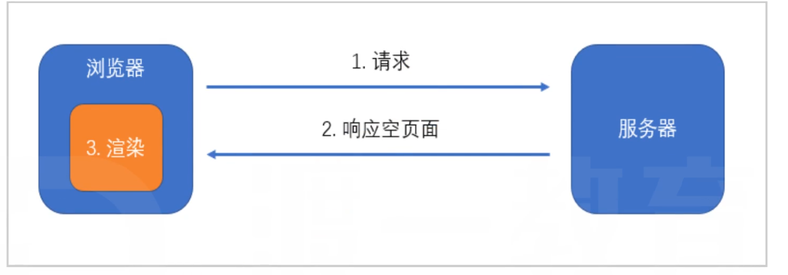
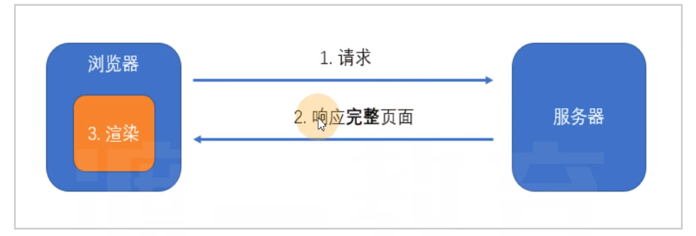

# CSR

CSR: client Side Rendering 客户端渲染

详细流程：

1. 浏览器发送请求到服务器
2. 服务器返回一个html文件，没有任何内容
3. **浏览器处于白屏状态**
4. 浏览器再此发送多个请求到服务器，分别请求css、js、图片
5. 服务器响应对应资源
6. 浏览器开始执行js
7. 浏览器渲染出可见页面

缺点

1. 浏览器可能长期处于白屏状态
2. 不利于SEO

# SSR

SSR: Server Side Rendering 服务端渲染

详细流程：

1. 浏览器发送请求到服务器
2. 服务器返回一个html文件，包含完整到HTML内容
3. 浏览器显示出页面
4. 浏览器再此发送多个请求到服务器，分别请求css、js、图片
5. 服务器响应对应资源
6. 浏览器开始执行js
7. 浏览器接管后续渲染

缺点

1. 开发相对麻烦
2. 增加服务器负担

