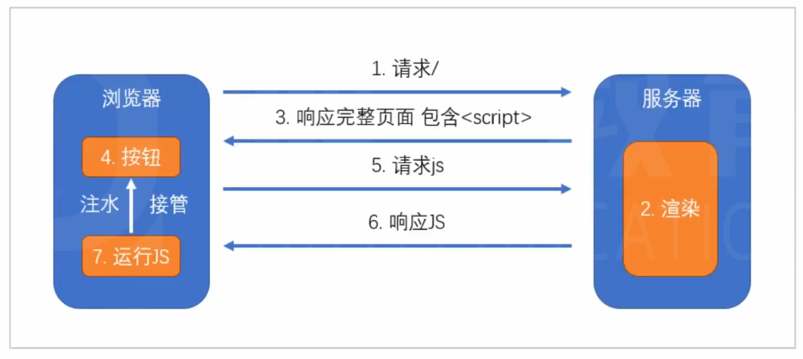

# 搭建express服务器

1. 搭建express服务器，对所有 get 请求均响应一个页面
2. 配置`package.json`，更加方便的启动服务器
3. 安装`nodemon`，监控文件变化

# 在服务器端渲染react组件

1. 服务器端书写`react`组件
2. 使用`webpack`打包**服务器代码**到`dist`目录
3. 利用`@babel/preset-react`解析`react`代码
4. 利用`externals`配置和`webpack-node-externals`排除掉`node_modules`目录
5. 重新配置`package.json`
6. 渲染页面组件的内容到`div`中

# 在客户端渲染组件

同构： 保持服务器端和客户端渲染一致

1. 书写客户端启动文件
2. 使用`webpack`打包**客户端代码**到`public`目录
3. 在服务端输出的`html`代码中引入`js`
4. 重新配置`package.json`

# 引入样式

1. 利用webpack生成样式文件

客户端的具有完整的样式依赖，经过`mini-css-extract-plugin`进行打包，生成样式

服务端可以没有完整的样式依赖，但是必须保证，生成的代码中，类样式和客户端保持一致

2. 在页面源代码中加入一个link元素，链接到样式文件

