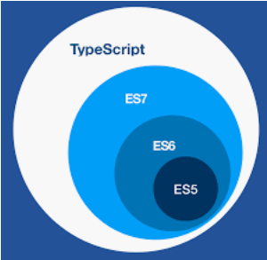

<!--
 * @Descripttion: 
 * @version: 
 * @Author: WangQing
 * @email: 2749374330@qq.com
 * @Date: 2020-01-14 10:29:20
 * @LastEditors  : WangQing
 * @LastEditTime : 2020-01-14 11:10:09
 -->
# 概述

## 为什么TypeScript

- 就业 或 获得更大的竞争力
- 获得更好的开发体验
- 解决JS中一些难以解决的问题

## JS开发中的问题

- 使用了不存在的变量、函数或成员
- 把一个不确定的类型当作一个确定的类型处理
- 使用null或undefined的成员

js原罪

- js语言本身的特性，决定了该语言无法适应大型的复杂的项目
- 弱类型：某个变量，可以随时更换类型
- 解释性：错误发生的时间，是在运行时

前端开发中，大部分时间都是在排错

## TypeScript

简称ts

ts是js的超集，是一个可选的、静态的类型系统

- 类型系统

对代码中所有的标识符（变量、函数、参数、返回值）进行类型检查

- 可选的

学习曲线非常平滑

- 静态的

无论是浏览器环境，还是node环境，无法直接识别ts代码

> babel: es6->es5

> tsc: ts->es

tsc: ts编译器

静态：类型检查的时间，在编译时，而非运行时

**ts常识**

- 2012年微软发布
- Anders Hejlsberg复杂开发ts项目
- 开源，拥抱es标准
- 版本3.7
- 官网： https://www.typescriptlang.org/

**额外的惊喜**

有了类型检查，增强了面向对象的开发

js中也有类和对象，js支持面向对象开发。没有类型检查，很多面向对象的场景实现起来有诸多问题

使用ts后，可以编写出完善的面向对象的代码