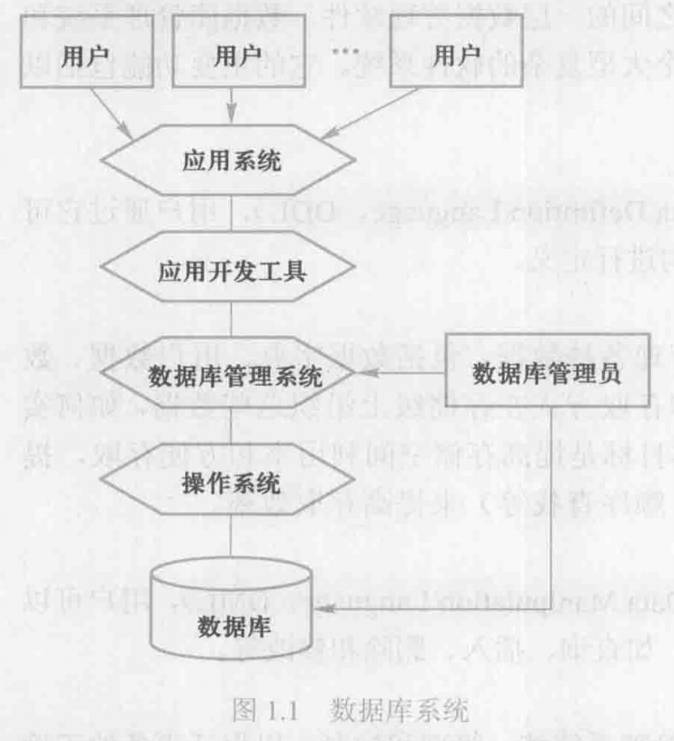
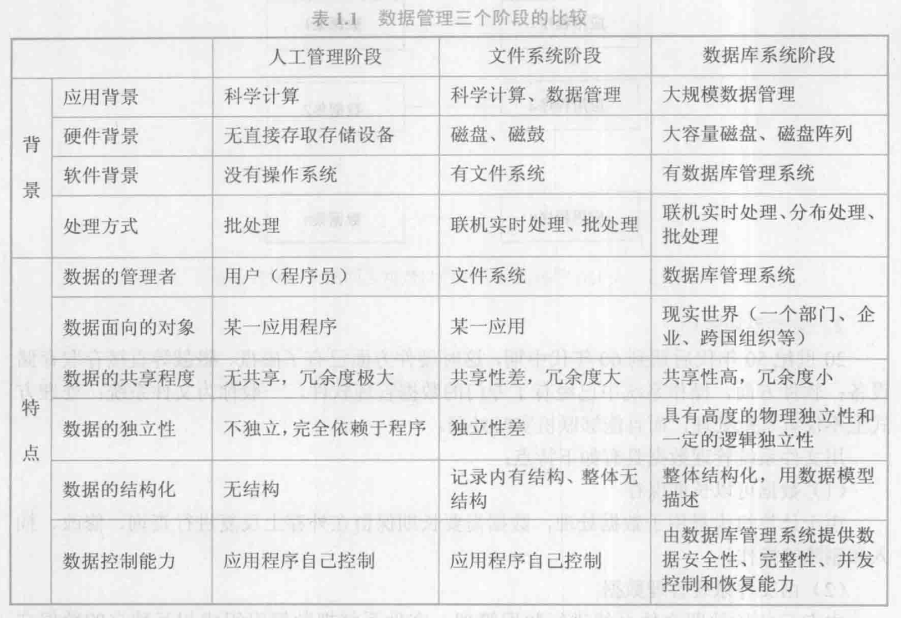

# 数据库系统概念

## 基本概念

1. 数据

数据是数据库中存储的基本对象

描述事物的符号记录称为数据

数据的含义称为数据的语义，数据与其语义是不可分的

2. 数据库

数据库是长期存储在计算机内、有组织的、可共享的大量数据的集合。数据库中的数据按一定的数据模型组织、描述和存储，具有较小的冗余度、较高的数据独立性和易扩展性，并可为各种用户共享

3. 数据库管理系统

数据库管理系统是位于用户与操作系统之间的一层数据管理软件。数据库管理系统和操作系统一样是计算机基础软件，也是一个大型复杂的软件系统。

1） 数据定义功能
2） 数据组织、存储与管理
3） 数据操纵功能
4） 数据库的事务管理和运行管理
5） 数据库的建立和维护功能
6） 其他功能（与其他软件通信，数据转换等）

4. 数据库系统

数据库系统是由数据库、数据库管理系统、应用程序和数据库管理员组成的存储、管理、处理和维护数据的系统

## 数据管理技术的产生和发展

## 数据库系统的特点

1. 数据结构化

数据库系统实现整体数据的结构化，这是数据库的主要特点之一，也是数据库系统和文件系统的本质区别。

2. 数据的共享性高、冗余度低且易扩展

数据共享可以大大减少数据冗余，节约存储空间。数据共享还能避免数据之间的不相容性和不一致性

3. 数据独立性高

物理独立性是指用户的应用程序与数据库中的数据物理存储是相互独立的

逻辑独立性是指用户的应用程序与数据库中的逻辑结构是相互独立的

4. 数据由数据库管理系统统一管理和控制

1） 数据的安全性保护
2） 数据的完整性检查
3） 并发控制
4） 数据库恢复