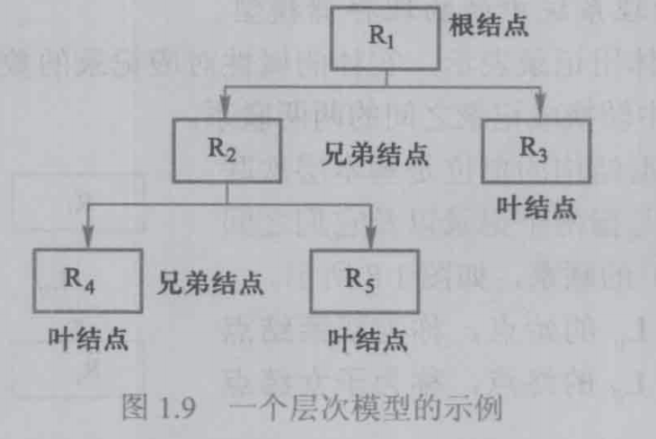

# 数据模型

数据模型是一种模型，是对现实世界数据特征的抽象

数据模型是数据库系统的核心和基础

## 两类数据模型

第一类 概念模型
第二类 逻辑模型和物理模型

- 概念模型 按用户的概念来对数据和信息建模，主要用于数据库设计
- 逻辑模型 按计算机系统的观点对数据建模，主要用于数据库管理系统的实现
- 物理模型 对数据最底层的抽象，描述数据在系统内部的表示方式和存取方法、或在磁带或磁盘上的存储方式和存取方法，是面向计算机系统的

## 概念模型

1. 实体 客观存在并可相互区别的事物
2. 属性 实体存在的某一特性
3. 码 唯一标识实体的属性
4. 实体型 用实体名及其属性名集合来抽象和刻画同类实体
5. 实体集 同一类型实体的集合
6. 联系 通常指不同实体集之间的联系（一对一、一对多、多对多）

## 数据模型的组成要素

1. 数据结构 描述数据库的组成对象以及对象之间的联系
2. 数据操作 对数据库各种对象的实例允许执行操作的集合
3. 数据的完整性约束条件 一组完整性规则

## 层次模型

1. 层次模型的数据结构

在数据库中定义满足下面两个条件的基本层次联系的集合为层次模型：
（1）有且只有一个结点没有双亲结点，这个结点称为根结点；
（2）根以外的其他结点有且只有一个双亲结点。

在层次模型中，每个结点表示一个记录类型，记录类型之间的联系用结点之间的连线（有向边）表示，这种联系是父子之间的一对多的联系。

2. 层次模型的数据操作与完整性约束

操作：查询、插入、删除、更新

插入、删除、更新需要满足模型的完整性约束条件

3. 层次模型的优缺点

- 优点
    - 层次模型的数据结构比较简单清晰，适合表达1:n
    - 查询效率高，性能优于关系模型，不低于网状模型
    - 层次数据模型提供了良好的完整性支持
- 缺点
    - 多对多联系表示不自然
    - 对插入和删除操作的限制多，应用程序的编写比较复杂
    - 查询子女结点必须通过双亲结点
    - 由于结构严密，层次命令趋于程序化

## 网状模型

1. 网状模型的数据结构

在数据库中，把满足以下两个条件的基本层次联系集合称为网状模型：
（1）允许一个以上的结点无双亲。
（2）一个结点可以有多于一个的双亲。

网状模型是一种比层次模型更具普遍性的结构。它去掉了层次模型的两个限制，允许多个结点没有双亲结点，允许结点有多个双亲结点；此外它还允许两个结点之间有多种联系（称之为复合联系）。

2. 网状模型的操作与完整性约束

没有层次模型那样严格的完整性约束，但具体的网状模型数据库系统对数据操作都加了一些限制

3. 网状模型的优缺点

- 优点
    - 能够更为直接地描述现实世界，如一个结点可以有多个双亲
    - 具有良好的性能，存取效率较高
- 缺点
    - 结构比较复杂，而且随着应用环境的扩大，数据库的结构就变得越来越复杂，不利于最终用户掌握
    - DDL、DML语言复杂，用户不容易使用
    - 应用程序在访问数据时必须选择适当的路径

## 关系模型

1. 关系模型的数据结构

2. 关系模型的操作与完整性约束

关系模型的数据操纵主要包括查询、插入、删除和更新数据。这些操作必须满足关系的完整性约束条件。

关系的完整性约束条件包括三大类：实体完整性、参照完整性和用户定义的完整性。

3. 关系模型的优缺点

- 优点
    - 关系模型与格式化模型不同，它是建立在严格的数学概念的基础上的。
    - 关系模型的概念单一。无论实体还是实体之间的联系都用关系来表示。对数据的检索和更新结果也是关系（即表）。所以其数据结构简单、清晰，用户易懂易用。
    - 关系模型的存取路径对用户透明，从而具有更高的数据独立性、更好的安全保密性，也简化了程序员的工作和数据库开发建立的工作。
- 缺点
    - 由于存取路径对用户是隐蔽的，查询效率往往不如格式化数据模型
    - 为了提高性能，数据库管理系统必须对用户的查询请求进行优化，因此增加了开发数据库管理系统的难度。不过用户不必考虑这些系统内部的优化技术细节。