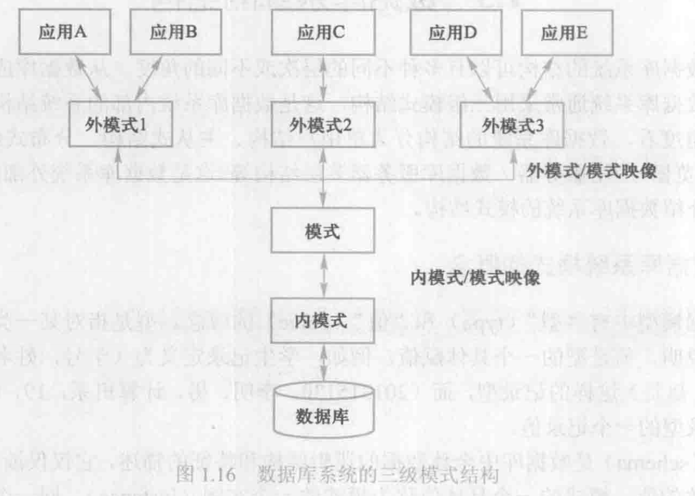

# 数据库系统的结构

## 数据库系统模式的概念

**型** 对某一类数据结构和属性的说明
**值** 型的具体赋值

**模式（Schema）**
- 数据库逻辑结构和特征的描述
- 是型的描述
- 反映的是数据的结构及其联系
- 模式是相对稳定的

**实例（Instance）**
- 模式的一个具体值
- 反映数据库某一时刻的状态
- 同一个模式可以有很多实例
- 实例随数据库中的数据的更新而变动

## 数据库系统三级模式结构

**模式（Schema）**
- "模式"（也称逻辑模式）
    - 数据库中全体数据的逻辑结构和特征的描述
    - 所有用户的公共数据视图，综合了所有用户的需求
- 一个数据库只有一个模式
- 模式的地位：是数据库系统模式结构的中间层
    - 与数据的物理存储细节和硬件环境无关
    - 与具体的应用程序、开发工具及高级程序设计语言无关
- 模式的定义
    - 数据的逻辑结构（数据项的名字、类型、取值范围等）
    - 数据之间的联系
    - 数据有关的安全性、完整性要求

**外模式（External Schema）**
- 外模式（也称子模式或用户模式）
    - 数据库用户（包括应用程序员和最终用户）使用的局部数据的逻辑结构和特征的描述
    - 数据库用户的数据视图，是与某一应用有关的数据的逻辑表示
- 外模式的地位：介于模式与应用之间
    - 模式与外模式的关系：一对多
        - 外模式通常是模式的子集
        - 一个数据库可以有多个外模式。反映了不同的用户的应用需求、看待数据的方式、对数据保密的要求对模式中同一数据，在外模式中的结构、类型、长度、保密级别等都可以不同
    - 外模式与应用的关系：一对多
        - 同一外模式也可以为某一用户的多个应用系统所使用
        - 但一个应用程序只能使用一个外模式
- 外模式的用途
    - 保证数据库安全性的一个有力措施
    - 每个用户只能看见和访问所对应的外模式中的数据

**内模式（Internal Schema）**
- 内模式（也称存储模式）
    - 是数据物理结构和存储方式的描述
    - 是数据在数据库内部的表示方式
        - 记录的存储方式（顺序存储，按照B树结构存储，按Hash方法存储）
        - 索引的组织方式
        - 数据是否压缩存储
        - 数据是否加密
        - 数据存储记录结构的规定
- 一个数据库只有一个内模式

## 数据库的二级映像功能与数据独立性

**外模式/模式映像**

对于每一个外模式，数据库系统都有一个外模式/模式映像，它定义了该外模式与模式之间的对应关系。这些映像定义通常包含在各自外模式的描述中。

当模式改变时（例如增加新的关系、新的属性、改变属性的数据类型等），由数据库管理员对各个外模式／模式的映像作相应改变，可以使外模式保持不变。应用程序是依据数据的外模式编写的，从而应用程序不必修改，保证了数据与程序的逻辑独立性，简称数据的逻辑独立性。

**模式/内模式映像**
模式／内模式映像是唯一的，它定义了数据全局逻辑结构与存储结构之间的对应关系。该映像定义通常包含在模式描述中。

当数据库的存储结构改变时（例如选用了另一种存储结构），由数据库管理员对模式/内模式映像作相应改变，可以使模式保持不变，从而应用程序也不必改变。保证了数据与程序的物理独立性，简称数据的物理独立性。