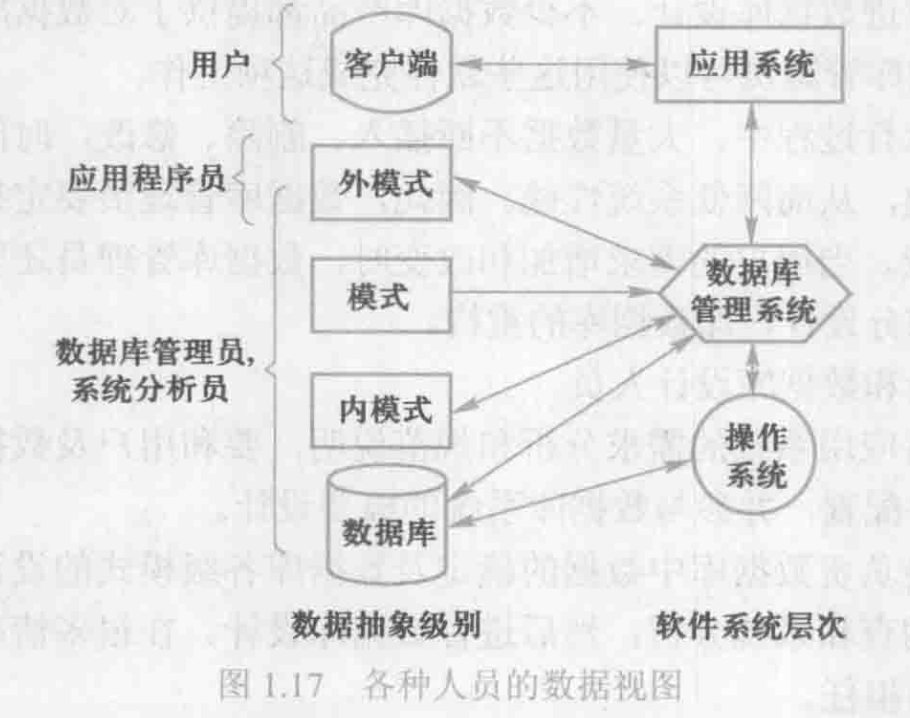

# 数据库系统的构成

## 硬件平台及数据库

1. 要有足够大的内存，存放操作系统、数据库管理系统的核心模块、数据缓冲区和程序。
2. 有足够大的磁盘或磁盘阵列等设备存放数据库，有足够大的磁带（或光盘）作数份。
3. 要求系统有较高的通道能力，以提高数据传送率。

## 软件 

1. 数据库管理系统。数据库管理系统是为数据库的建立、使用和维护配置的系统软件。
2. 支持数据库管理系统运行的操作系统。
3. 具有与数据库接口的高级语言及其编译系统，便于开发应用程序。
4. 以数据库管理系统为核心的应用开发工具。应用开发工具是系统为应用开发人员终用户提供的高效率、多功能的应用生成器、第四代语言等各种软件工具。它们为数系统的开发和应用提供了良好的环境。
5. 为特定应用环境开发的数据库应用系统。

## 人员

