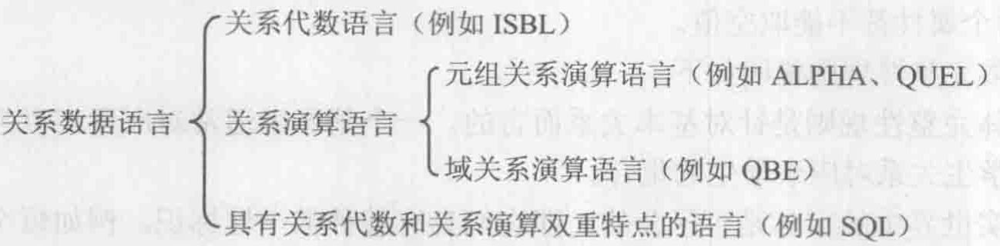

# 关系操作

## 基本关系操作

- 查询（query)
    - 选择（select）
    - 投影（project）
    - 连接（join）
    - 除（divide）
    - 并（union）
    - 差（except）
    - 交（intersection）
- 插入（insert）
- 删除（delete）
- 修改（update）

**操作的对象和结果都是集合**

## 关系数据语言的分类

