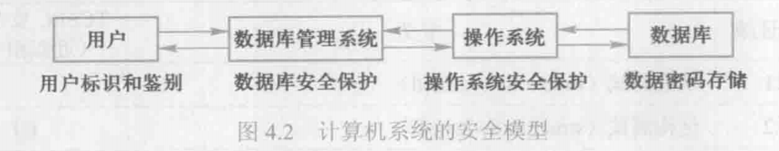
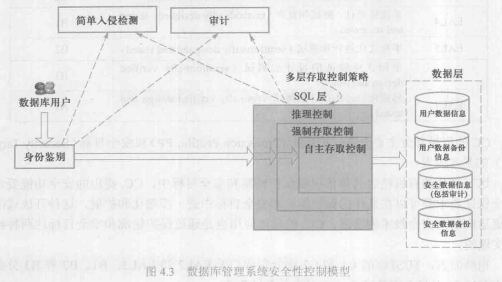
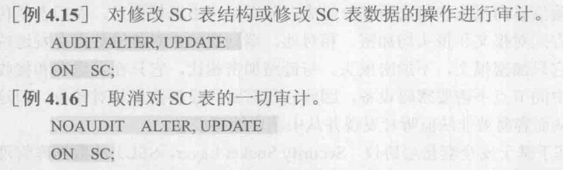

# 数据库安全控制





## 用户身份鉴别

是数据库管理系统提供的最外层安全保护措施；系统提供一定的方式让用户标识自己的名字和身份，系统进行核实，通
过鉴定后才提供系统使用权。

1. 静态口令鉴别
2. 动态口令鉴别
3. 生物特征鉴别
4. 智能卡鉴别

## 存取控制

存取控制主要包括定义用户权限和合法权限检查；对于获得上机权的用户还要根据系统预先定义好的外模式（视图）或用户权限进行存取控制，保证用户只能存取他有权存取的数据。

自主存取控制（Discretionary Access Control，DAC），C2级，灵活
强制存取控制（Mandatory Access Control，MAC），B1级，严格

## 视图机制

视图能够把要保密的数据对无权存取这些数据的用户隐藏起来，因此对数据提供一定程度的安全保护。

视图机制间接实现了支持存取谓词的用户权限定义。

```
[例]建立计算机系学生的视图，把对该视图的SELECT权限授于王平，把该视图上的所有操作权限授于张明。

先建立计算机系学生的视图CS_Student
CREATE VIEW CS_Student AS
SELECT * FROM Student WHERE Sdept='CS'

在视图上进一步定义存取权限：
GRANT SELECT ON CS_Student TO 王平；
GRANT ALL PRIVILIGES ON CS_Student TO 张明；
```

## 审计

系统自动建立审计日志，将用户对数据库的所有操作记录在上面;
DBA利用审计日志找出非法存取数据的人、时间和内容;
C2以上安全级别的DBMS必须具有。

- 用户级审计：针对自己创建的数据库表或视图进行审计。
    - 记录所有用户对这些表或视图的一切成功和（或）不成功的访问要求以及各种类型的SQL操作。
- 系统级审计：由DBA设置
    - 监测成功或失败的登录要求；
    - 监测GRANT和REVOKE操作以及其他数据库级权限下的操作。



## 数据加密

数据库中的数据以密码形式存放，使用时由用户设计的解码程序将其转换成用户可读的数据。这样，数据库中的数据即使被窃取，也只能是一些无法辨认的代码。

数据库加密：存储加密、传输加密

数据库加密在哪个层次实现？
- OS层
- DBMS内核层
- DBMS外层
