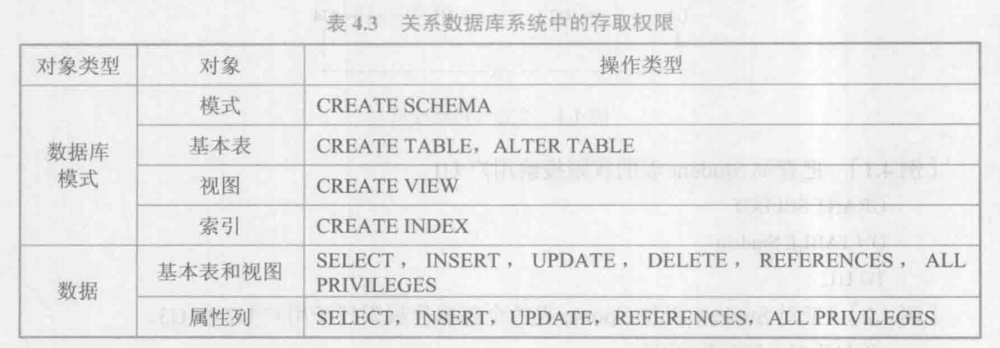
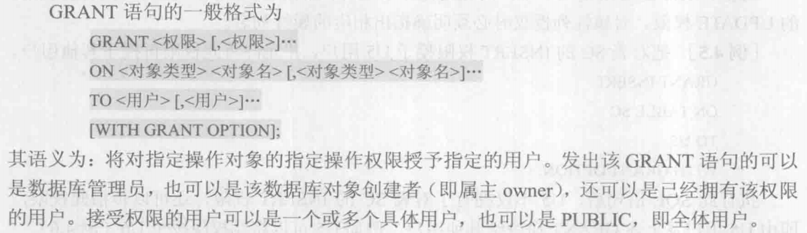
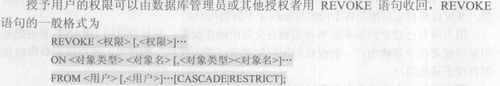
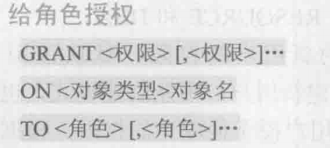
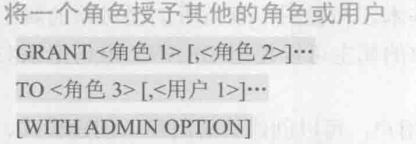
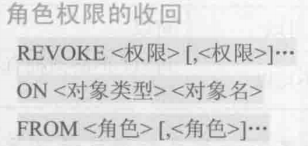

## 自主存取控制方法

用户对于不同的数据库对象有不同的存取权限，不同的用户对同一对象也有不同的权限，而且用户还可将其拥有的存取权限转授给其他用户。

用户权限组成要素：数据对象、操作类型

授权：定义用户可以在哪些数据库对象上进行哪些类型的操作。

## 授权：授予与回收

1. GRANT

2. REVOKE

3. 创建数据库模式的权限

## 数据库角色

数据库角色是被命名的一组与数据库操作相关的权限

- 角色是权限的集合
- 可以为一组具有相同权限的用户创建一个角色
- 简化授权的过程

