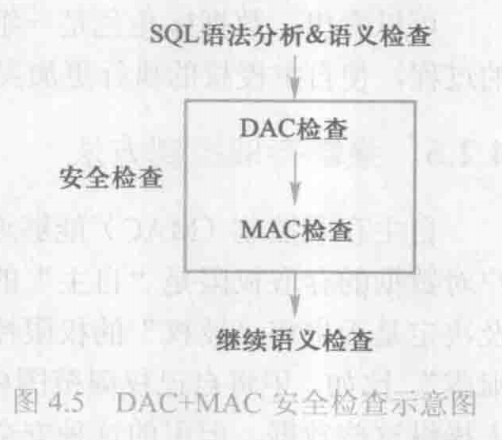

# 强制存取控制

问题：自主存取控制仅仅通过对数据的存取权限进行安全控制，而数据本身并无安全性标记，可能存在数据的“无意泄露”。

解决：对系统控制下的所有主客体赋予安全性标记，系统根据标记安全策略，实施强制存取控制。

## 强制存取控制方法
- 主体是系统中的活动实体
    - DBMS所管理的实际用户
    - 代表用户的各进程
- 客体是系统中的被动实体，是受主体操纵的
    - 文件、基表、索引、视图
- 敏感度标记（Label）
    - 绝密（Top Secret)>机密（Secret)>可信（Confidential)>公开（Public）
- 主体的敏感度标记称为**许可证级别**（Clearance Level）
- 客体的敏感度标记称为**密级**（Classification Level）
- 强制存取控制就是通过对比主体的许可证级别和客体的密级，最终确定主体能否存取客体。

## 强制存取控制规则

1. 仅当主体的许可证级别大于或等于客体的密级时，该主体才能读取相应的客体
2. 仅当主体的许可证级别小于或等于客体的密级时，该主体才能写相应的客体

**规则的关键点**:禁止拥有高许可证级别的主体更新低密级的数据对象

## 强制存取控制的优点

1. 禁止拥有高许可证级别的主体更新低密级的数据对象，从而保证了敏感数据的可靠性；
2. 禁止低许可证级别的主体浏览高密级的数据，避免了敏感数据的泄漏；
3. MAC对数据本身进行密级标记，无论数据如何复制，标记与数据是不可分割的整体。只有符合密级标记要求的用户才可以操作相应数据，提高了安全性级别。

