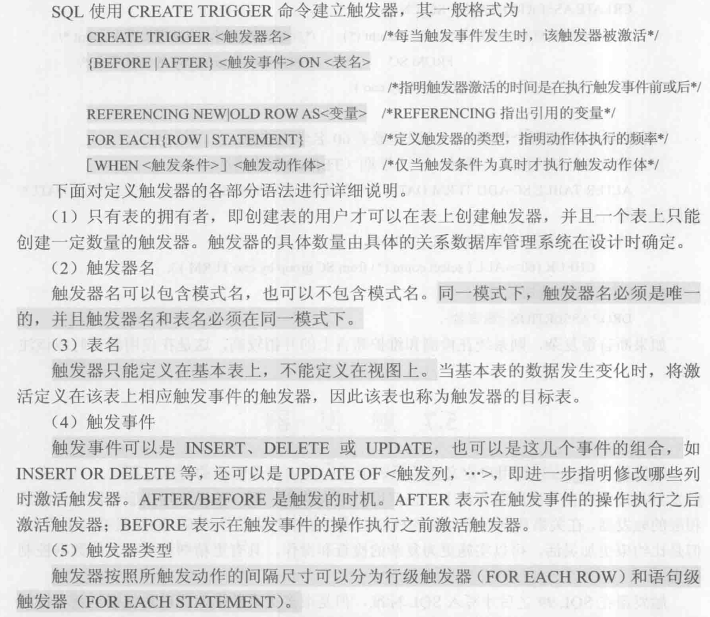
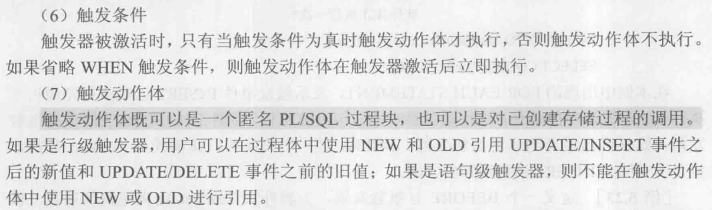

# 触发器（Trigger）

触发器：是用户定义在关系表上的一类由事件驱动的特殊过程。亦称为：事件-条件-动作规则。

- 一旦定义，触发器将被保存在数据库服务器中。
- 任何用户对表的增、删、改操作均由服务器自动激活相应的触发器，在DBMS核心层进行集中的完整性控制。
- 比约束更为灵活，规则中的动作可以很复杂，可以包含 if/while/case 等程序控制指令，可以涉及其他表和其他数据库对象，实施更为复杂的检查和操作，具有更精细和更强大的数据控制能力。

## 定义触发器

## 激活触发器

触发器的执行，由触发事件激活，并由数据库服务器自动执行。

一个数据表上可能定义了多个触发器，同一个表上的多个触发器激活时遵
循如下的执行顺序：
1. 执行该表上的BEFORE触发器；
2. 执行激活触发器的SQL语句；
3. 执行该表上的AFTER触发器。

有多个触发器时，按创建时间顺序依次执行。

任一触发器的执行失败都将中止整个操作。

## 删除触发器

删除触发器的SQL语法：DROP TRIGGER<触发器名> QN <表名>；

触发器必须是一个已经创建的触发器，并且只能由具有相应权限的用户删除。