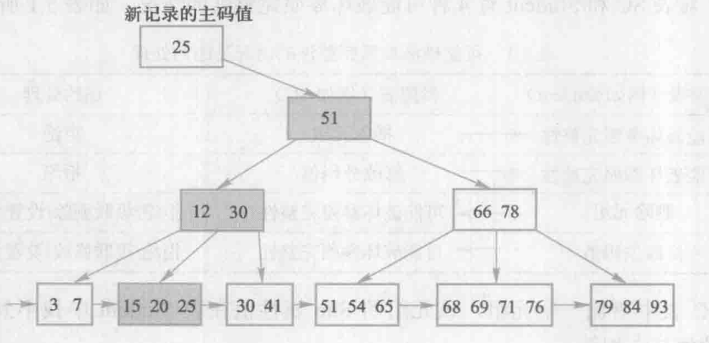
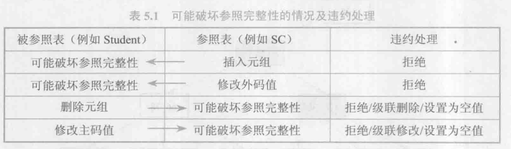
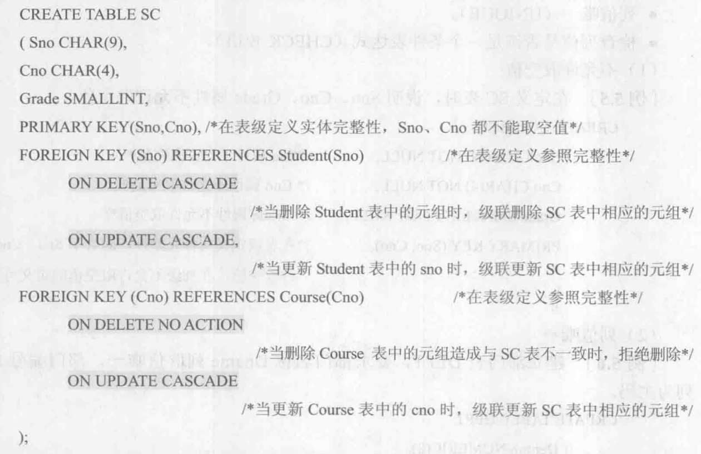

# 数据库完整性

数据库完整性是指数据的正确性和相容性

1. 提供定义完整性约束条件的机制
2. 提供完整性检查的方法
3. 进行违约处理

## 实体完整性

- 实体完整性的定义机制：
    - CREATE TABLE中用PRIMARY KEY定义
    - 列级约束条件 或 表级约束条件
- 实体完性的检查和违约处理
在插入或对主码列进行更新操作时，RDBMS按照实体完整性规则自动进行检查。包括：
    - 检查主码值是否唯一，如果不唯一则拒绝插入或修改
    - 检查主码的各个属性是否为空，只要有一个为空就拒绝插入或修改

## 参照完整性

- 参照完整性的定义机制
    - 在CREATE TABLE中用FOREIGN KEY短语定义哪些列为外码，
    - 用REFERENCES短语指明这些外码参照哪些表的主码

违约处理

## 用户定义的完整性

用户定义的完整性就是针对某一具体应用的数据必须满足的语义要求.

分为：属性上的约束和元组上的约束。

### 属性上的约束：在CREATE TABLE中定义属性时定义

- 列值非空（NOT NULL），列值唯一（UNIQUE），检查列值是否满足一个布尔表达式（CHECK）
- 插入元组或修改属性值时检查，不满足则拒绝执行。

### 元组上的约束
- 在CREATE TABLE时可以用CHECK短语定义元组上的约束条件，即元组级的限制
- 同属性值限制相比，元组级的限制可以设置不同属性之间的取值的相互约束条件
- 插入元组或修改属性值时检查，不满足则拒绝执行。
