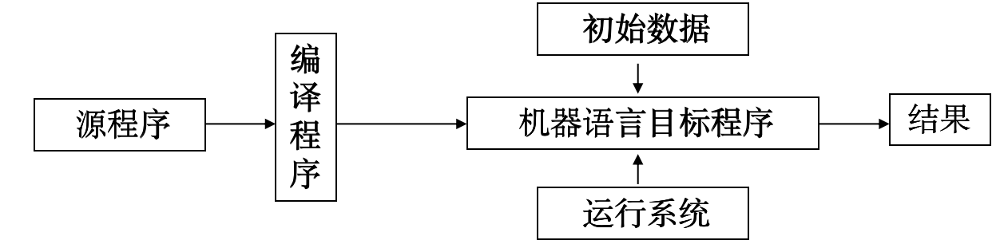

# 引论

## 什么是编译程序

编译程序是现代计算机系统的基本组成部分。

从功能上看，一个编译程序就是一个语言翻译程序,它把一种语言(称作源语言)书写的程序翻译成另一种语言(称作目标语言)的等价的程序.

> 目的：使得程序员不必考虑机器的细节，独立于机器。

源程序的编译和运行阶段(编译的目标代码为机器语言):

源程序的编译、汇编和运行阶段（目标代码为汇编）:

## 编译过程和编译程序结构

### 词法分析

单词是字母组成的有具体含义的最小成分。

从输入串中划分出一系列的单词。（认出英文句子的单词。）
This line is a longer sentence.

单词的特性
- 每个单词都有明确意义
- 单词中字母的顺序是固定的（ ist his linealo gerse nte nce 不是正确的单词）
- 单词的个数是有限的，（请思考有何意义？）
- 在句子中空格是单词分隔符，空格是特殊的单词。
- 句点是特殊的单词，是句子结束标志

> 从左至右扫描字符流的源程序、分解构成源程序的字符串，识别出(拼)一个个的单词（符号）

单词符号是语言中具有独立意义的最基本结构。多数程序语言中，单词符号一般包括 五种类型
1. 常数
2. 保留字
3. 标识符
4. 运算符
5. 界符等类型

**单词符号是由词法规则所确定的。词法规定了字母表中哪样的字符串是一个单词符号。**

### 语法分析

功能:层次分析.依据源程序的语法规则把源程序的单词序列组成语法短语(表示成语法树).

### 语义分析

### 中间代码生成

### 代码优化

### 目标代码生成

### 符号表管理

- 记录源程序中使用的各种符号名称
- 收集每个符号的各种名称的属性信息
    - 类型、作用域、分配存储信息
- 符号表管理(）
    - 登录：扫描到说明语句就将标识符登记在符号表中
    - 查找：在执行语句查找标识符的属性，判断语义是否正确

### 错误检查

- 报告出错信息
- 排错
- 恢复编译工作

## 解释程序和一些软件工具

采用编译方式的编译程序称为编译型的编译程序，简称编译程序；采用解释方式的编译程序称为解释型的编译程序，简称解释程序。

- 编译方式是先翻译后执行，即将整个源程序翻译完毕，再执行目标程序，只需要保存完整的目标程序而无需保存源程序。一次翻译后无需再翻译，可多次执行。
- 解释方式是边翻译边执行，即翻译一句就执行一句，翻译完毕也执行完毕，只保存源程序无需保存完整的目标程序。执行一次需要翻译一次。 

**存储结构**

### 处理源程序的软件工具

1. 语言的结构化编辑器
2. 语言程序的调试工具
3. 程序格式化工具　
4. 语言程序测试工具
5. 程序理解工具　
6. 高级语言之间的转换工具

### 编译技术的发展

编译程序的实现方式
- 手工
    - 机器语言
    - 汇编
    - 系统程序设计语言
- 自展，交叉编译
- 自动构造工具，如 lex  yacc
- 编译基础设施（多源语言多目标机体系结构的编译程序构造和编译技术研究平台）

重要方向：
- 并行编译技术– 面向高性能计算
- 交叉编译技术– 面向嵌入式计算
