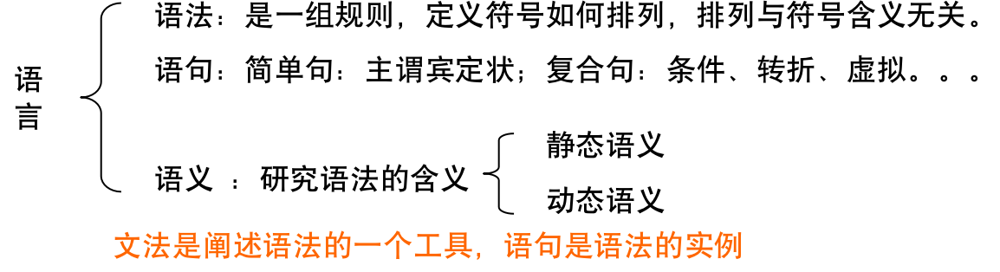
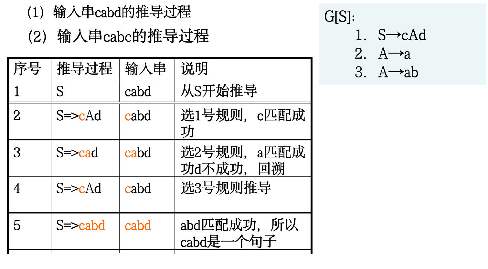

# 文法与语言

## 文法的直观概念 

## 符号和符号串 

### 基本概念

- **字母表**  字母表∑是非空有穷集合，其元素称为符号。
- **符号串**  由字母表∑中的符号组成的有穷序列称为 (字母表∑上的)符号串。特别地，不含任何符号的有穷序列称为空串，记为ε。单词和源程序都是符号串！
- **符号串长度**  符号串α的长度是指符号串α中含有符号的个数，记为︱α︱。特别约定，空串ε为零，即︱α︱＝0。
- **符号串集合**  如果集合A的元素都是字母表∑上的符号串，则称集合A为∑上的符号串集合，简称串集。

### 基本运算

- **符号串连接运算**  设x和y是字母表∑上的符号串，在符号串x的最后一个符号之后顺序接上符号串y的符号得到的新符号串z，则称符号串z是由符号串x和符号串y经过连接运算的结果，记为z＝x·y，其中，·是连接运算符。
- **符号串方幂运算**  设x是字母表∑上的符号串，z是由n(≥0)个x自身连接得到的符号串，则称符号串z是由符号串x的n次方幂运算的结果，记为z ＝ xn 。特别约定，x0 ＝ε, x1＝x 。
- **符号串集连接运算**  设A，B是字母表∑上的符号串集，·是符号串集连接运算，则C＝A·B＝｛x·y︱x∈A ，y∈B｝。 笛卡尔积
- **符号串集方幂运算**  设A是字母表∑上的符号串集，则C是由n(≥0)个A自身连接得到的符号串集，则称符号串集C是由符号串A的n次方幂运算的结果，记为C ＝ An 。特别约定，A0 ＝｛ε｝,A1＝A 。
- **符号串集正闭包运算** 设A是字母表∑上的符号串集， A+是A的正闭包，则:  A+＝A1∪A2∪A3∪···∪An··· 。 
- **符号串集闭包运算**  设A是字母表∑上的符号串集， A*是A的闭包，则 :  A* ＝A0∪A+ ，  即：A* ＝A0∪A1∪A2∪A3∪···∪An··· 。

## 文法和语言的形式定义

### 文法

文法G定义为一个四元组（VN，VT，P，S），记为G＝（VN，VT，P，S）。其中，
1. VN是非空有穷集合，称为非终结符集，其元素称为非终结符；
2. VT是有穷集合，称为终结符集，其元素称为终结符；
3. P是非空有穷集合，称为规则集，其元素是字母表VN∪VT上的规则，VN∪VT称为文法的字母表V，且VN∩VT＝；
4. S∈VN，称为开始符。

### 直接推导、直接归约

设文法G＝（VN，VT，P，S），如果α→β∈P，则称γαδ推导出γβδ，记为γαδ∈γβδ，其中,γ,δ∈V*。
γαδ∈γβδ也称为直接推导或一步推导。
如果γαδ∈γβδ，则也称为γβδ归约到γαδ，也称为直接归约或一步归约。 

### 多步推导、多步规约

设文法G＝（VN，VT，P，S），α,β（VN∪VT）*， 如果α,β之间存在推导序列：
α＝ W0 => W1 => W2 ··· => Wn ＝β（n≥1）,
则称α经过n步推导出β，记为α=>β。其中，Wi∈(VN∪VT)* 
(1≤i≤n)。α=>β也称n步推导或多步推导。
如果α=>β，也称为β归约到α，也称为n步归约或多步归约。

### 0步或0步以上推导与归约

设文法G＝（VN，VT，P，S），α,β∈（VN∪VT）*，如果有α→β或α=>β，则称α经过0步或0步以上推导出β，记为α=>β。亦称β经过0步或0步以上归约到α。

### 句型、句子

设文法G＝（VN，VT，P，S），如果有S*=>β，则称β是文法G的句型。如果有S*=>β，且β∈VT*，则称β是文法G的句子。 

### 语言

文法G＝（VN，VT，P，S）的产生语言定义为文法G的句子集合，记为L(G)。即：
L(G)＝｛β︱S=>β，β∈VT*｝。 

### 文法等价

设G1 和G2是两个文法，如果L(G1)＝L(G2)，则称文法G1和G2是等价的。

## 文法类型

### O型文法

设文法G＝（VN，VT，P，S），如果任意α→β∈P，α中至少含有一个非终结符，则称文法G属于0型文法。0型文法，也称为短语文法。

### 1型文法

设文法G＝（VN，VT，P，S），如果任意α→β∈P，α中至少含有一个非终结符，且除空规则之外，α的长度不大于β的长度，即︱α︱≤︱β︱，则称文法G属于1型文法。 1型文法，也称为上下文有关文法。

### 2型文法

设文法G＝（VN，VT，P，S），如果任意α→β∈P，α∈VN ，则称文法G属于2型文法。2型文法，也称为上下文无关文法。

### 3型文法

设文法G＝（VN，VT，P，S），如果任意α→β∈ P，α∈ VN ，且β只能是aB或a（除空规则之外），则称文法G属于右线性3型文法。
设文法G＝（VN，VT，P，S），如果任意α→β∈ P，α∈ VN ，且β只能是Ba或a（除空规则之外），则称文法G属于左线性3型文法。
左线性3型文法和右线性3型文法，统称3型文法，也称为正规文法。

## 上下文无关文法及其语法树 

上下无关文法一个显著特征是规则左部一定有且仅有一个非终结符。利用这个特征，可以不列出VN和VT ，给出一个上下无关文法的简洁描述方法：①文法名G改写成G[S]，其中，S表示开始符；②规则集P，仅书写其具体规则。

### 最左推导、最右推导

如果在推导的每一步总是选择当前句型的最左（最右）边非终结符进行推导，则称这种推导过程为最左（最右）推导。最右推导，也叫规范推导。由规范推导所得的句型，叫做规范句型。规范推导的逆过程，叫做规范归约。 

### 语法树

假设文法G＝（VN，VT，P，S），则文法G的语法树是一个满足下列条件的多叉树：
（1）以文法开始符S做为树根；
（2）以终结符号或非终结符号做为树的其他结点，且子树根和其孩子结点分别是某规则的左部和右部。

### 语法二义性

如果一个文法G，某个句子存在对应的至少两棵不同的语法树，则称文法G是二义性的。
① 如果文法是无二义性的，一个句子的语法树反映了该句子的全部推导过程；② 如果文法是无二义性的，一个句子的最左（最右）推导是唯一的。 

## 句型分析 

### 自上而下的分析方法

自上而下分析法：从文法开始符号出发，反复使用规则，寻找匹配符号串（推导）的句型，直到推导出句子或规则用遍。

### 自下而上的分析方法

从输入符号串α开始，逐步进行“归约”，直至归约出文法的开始符号 S，则输入串α是文法G定义的语言的句子。否则不是。

## 短语、直接短语、句柄

设G[S]是一文法，αβδ是文法G的句型，如果有S*=>αAδ且A+=>β，则称β是句型αβδ的、相对于非终结符A的短语。
特别地，当A+=>β实际是A=>β即一步推导时，则又称β是句型αβδ的、相对于非终结符A的直接短语（或简单短语）。
句型的最左直接短语，称为该句型的句柄。 

