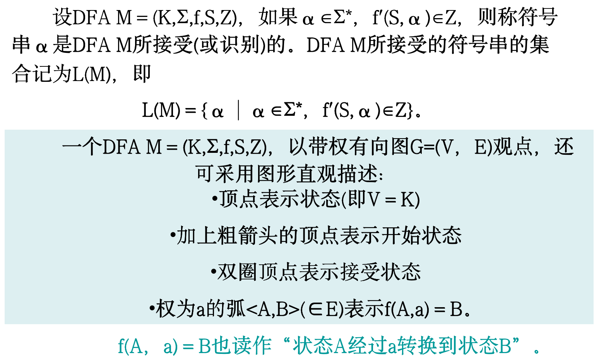

# 词法分析

## 1 词法分析程序设计

### 1.1 词法分析任务

词法分析阶段是编译的第一阶段，它的主要任务是从左至右扫描文本格式的源程序，从基于字符理解的源程序中分离出符合源语言词法的单词，最终转换成基于单词理解的源程序

**输出形式为：（单词种类，单词）**

计算机高级语言一般都有**关键字、标识符、常数、运算符和定界符**这5类单词

### 1.2 词法分析程序和语法分析程序的接口方式

词法分析程序通常与后阶段语法分析程序接口有下列两种方式

1. 词法分析程序和语法分析程序各自独立一趟方式。即词法分析程序把字符流的源程序转换成单词流的内部程序形式，供语法分析程序之用。

2. 词法分析程序和语法分析程序合并为一趟方式。即词法分析程序由反复语法分析程序调用，每调用一次从源程序中一个新单词返回给语法分析程序。

## 2 单词的形式化描述工具

基于生成观点、计算观点和识别观点，分别形成了**正规文法**、**正规式**和**有穷自动机** 3种用于描述计算机高级语言词法的工具

### 2.1 正规文法

### 2.2 正规式

基于字母表∑上的**正规式（也称为正则表达式）**定义如下,正规式e的计算值称为正规集,记为L(e)

1. ε是∑上的正规式，L(ε)＝ {ε} 
2. Ф是∑上的正规式，L(Ф)＝Ф
3. 任何a∈∑，a是∑上的正规式，L(a)＝ {a}
4. 如果e1和e2是∑上的正规式，则
   1. (e1)是∑上的正规式，L((e1))＝L(e1)
   2. e1︱e2 是∑上的正规式，L(e1︱e2)＝L(e1)∪L(e2)
   3.  e1 · e2 是∑上的正规式，L(e1· e2)＝L(e1)·L(e2)
   4.  e1* 是∑上的正规式，L(e1*)＝L(e1)* 

两个正规式e1和e2相等，是指正规式e1和e2 计算值相等(即L(e1)＝ L(e2))，记为e1＝ e2 。
设r,s,t为正规式，则正规式有如下定律：
1. 交换律：r︱s ＝ s︱r 
2. 结合律：（r︱s）︱t ＝ r︱（s︱t）
（r·s）·t ＝ r·（s·t）
3. 分配律：r·（s︱t）＝ r·s︱r·t
（s︱t）·r ＝ s·r︱t·r

### 2.3 正规式和正规文法之间转换

如果正规式r和文法G，有L(r)＝L(G)则称**正规式r和文法G是等价的**

r->G:

G->r:

## 3 有穷状态机

### 3.1 确定有穷状态机

### 3.2 不确定有穷状态机

### 3.3 自动机的等价性

如果FA M1 和FA M2接受相同的符号串的集合(即L(M1)＝L(M2))，则称FA M1和FA M2是等价的。

### 3.4 状态集合的映射和闭包运算

### 3.5 NFA到DFA转换方法(子集法)

### 3.6 DFA最小化

确定有穷自动机DFA M的简化是指寻找与之等价的、状态个数达到最小的DFA M'。这样的DFA M'，称为最小化的DFA

## 4 正规式和有穷自动机的等价性

### 4.1 NFA=>正规式

### 4.2 正规式=>NFA

## 5 正规文法和有穷自动机间的转换

### 5.1 右线性文法=>NFA

### 5.2 左线性文法=>NFA

### 5.3 DFA=>右线性文法

